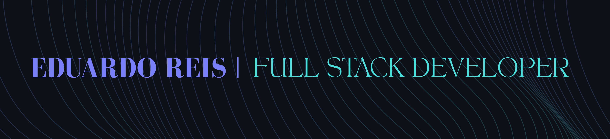

  

  # Olá! Eu sou o Eduardo Reis 👋
  
  
  
  
  **Desenvolvedor Full Stack | Estudante de ADS**
  *Transformando ideias em aplicações que funcionam de verdade.*

---

### 🚀 Sobre Mim
- 🎓 Estudante de **Análise e Desenvolvimento de Sistemas**.
- 🛠️ Concluí um bootcamp intensivo na **Generation Brasil**, com foco em desenvolvimento web.
- 💻 Experiência com **TypeScript (React & NestJS)** e atualmente aprofundando em **C# e ASP.NET**.
- 📍 Porto Alegre, RS.

---

### 🛠️ Tecnologias e Ferramentas

**Back-end (foco atual)**  

**Front-end**  

**Banco de Dados**  

**Linguagens**  

**Tools**  

---

### 📂 Projetos em Destaque

* **[Portfolio](https://eduardoreis.dev)** - Portfolio profissional (React).
* **[LearnFlix](https://github.com/eduardo-olvreis/LearnFlix)** - Plataforma de gerenciamento escolar (React).
* **[CRMed / Back](https://github.com/Grupo-02-Turma-JavaScript-10/projeto_integrador_crm_clinica)** - API RESTful robusta construída em grupo (NestJS e MySQL).
* **[CRMed / Front](https://github.com/Grupo-02-Turma-JavaScript-10/CRM_clinica_front)** - Interface administrativa moderna desenvolvida em grupo (React e Tailwind CSS).
