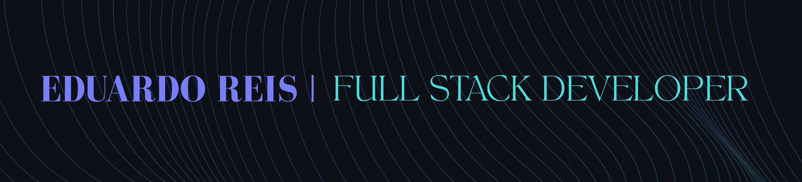

  

  # Olá! Eu sou o Eduardo Reis 👋
  
  
  
  
  ###Desenvolvedor .NET / Full Stack | Análise e Desenvolvimento de Sistemas###  
  *Foco na construção de APIs RESTful robustas, escaláveis e testadas no ecossistema .NET.*

---

### 🚀 Sobre Mim
* 🎓 Cursando **Análise e Desenvolvimento de Sistemas** (Infnet).
* 🛠️ Concluí o bootcamp intensivo da **Generation Brasil** (+420h) focado em desenvolvimento web Full Stack.
* 💻 Foco principal no ecossistema **.NET (C# / ASP.NET Core)**, **Clean Architecture**, **Testes Automatizados (xUnit/Moq)** e **Docker**.
* 🌐 Experiência prévia na criação de aplicações web completas com **NestJS**, **React** e **TypeScript**.
* 📍 Porto Alegre - RS.

---

### 🛠️ Tecnologias e Ferramentas

**Linguagens**  

**Back-end**  

**Banco de Dados**  

**Front-end**  

**Tools & DevOps**  

---

### 📂 Projetos em Destaque

* **[Rental Pipeline API](https://github.com/eduardo-olvreis/rentalpipeline-api)** — API RESTful em .NET e PostgreSQL para gestão de esteiras de locação imobiliária. Desenvolvida com **Clean Architecture**, controle de estado/concorrência, suíte de testes com **xUnit/Moq** e containerização com **Docker**.
* **[MatchTracker API](https://github.com/eduardo-olvreis/matchtracker-api)** — Web API em .NET / ASP.NET Core focada no gerenciamento de partidas e estatísticas esportivas com **Entity Framework Core**.
* **[CRMed - Backend](https://github.com/Grupo-02-Turma-JavaScript-10/projeto_integrador_crm_clinica)** — API RESTful Full Stack desenvolvida em grupo sob metodologias ágeis com **NestJS**, **TypeORM** e **MySQL**.

---

### 📬 Vamos nos conectar?
* **LinkedIn:** [in/eduardo-olvreis](https://www.linkedin.com/in/eduardo-olvreis/)
* **Portfólio:** [eduardoreis.dev](https://www.eduardoreis.dev/)
* **E-mail:** eduardo.olvreis@gmail.com
